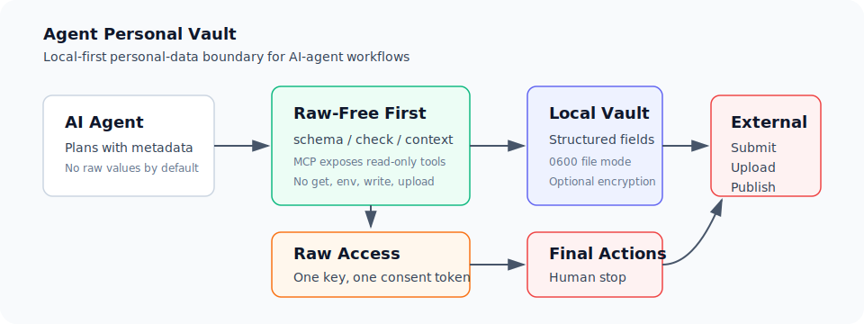

# Agent Personal Vault

日本語タイトル: AIエージェント向け個人情報ローカルVault

`Agent Personal Vault` は、Codex などのAIエージェントがユーザーの個人情報をローカルで管理し、必要な時だけ最小限に参照するためのローカルファーストな管理レイヤーです。



## Alpha Safety Notice

このプロジェクトはalpha版のローカル実験ユーティリティです。

- 既定では保存データを暗号化しません。
- 侵害済み端末、共有端末、マルウェア、OSユーザー権限を持つ攻撃者からは守れません。
- `get` と `env` はraw個人情報を表示します。ログ、Issue、スクリーンショット、外部AI、Subagent指示へ貼らないでください。
- `get` と `env` は事前に承認された一回限りのconsent tokenを要求します。
- `get` / `env` / `set` / `unset` / `consent` / GUI保存はraw値なしの監査ログを書きます。`--purpose` にも実個人情報を書かないでください。
- consent tokenは、同一OSユーザーやシェル実行権限を持つagentに対する強いセキュリティ境界ではありません。信頼できないagentにこのCLIや保存先へのアクセスを渡さないでください。
- 保存時暗号化はoptionalです。使う場合は `agent-personal-vault[encrypted]` とpassphraseが必要です。
- 法令遵守、本人確認、応募、送信、アップロード、契約、金融、医療、企業利用の安全性は保証しません。
- GitHub IssueやDiscussionに、氏名、住所、電話番号、メール、顔写真、証明書、実データのスクリーンショットを投稿しないでください。

安全な使い方は「raw値を保存する前に、まず `schema` / `context` / `check` でrawなしの流れを確認する」ことです。

## 5分で試す

まずはdummy値かローカルで扱ってよい値だけで試してください。`get` の結果はraw値なので、ログ、Issue、外部AIへ貼らないでください。

```sh
python3 -m pip install -e .
export APV_STORE="$(mktemp -d)/vault.json"

agent-personal-vault --store "$APV_STORE" init
printf 'Example\n' | agent-personal-vault --store "$APV_STORE" set FAMILY_NAME --stdin --purpose "dummy local quickstart"
printf 'Taro\n' | agent-personal-vault --store "$APV_STORE" set GIVEN_NAME --stdin --purpose "dummy local quickstart"
printf 'taro@example.test\n' | agent-personal-vault --store "$APV_STORE" set EMAIL --stdin --purpose "dummy local quickstart"

agent-personal-vault --store "$APV_STORE" context --task "応募フォームの氏名とメール連絡先を下書きする"
```

MCPクライアントには、stdio serverとして次のコマンドを設定します。このコマンドはserverとして待機するため、通常のシェルで順番に実行するコマンドではありません。

```sh
apv-mcp --store "$APV_STORE"
```

MCPクライアントでは、まず `apv.context` を呼び、raw値なしの候補keyを確認します。raw値が必要になったら `apv.request_consent` で `FULL_NAME` など1 keyだけを要求します。その後、GUIを起動して人間が承認します。

```sh
apv-gui --store "$APV_STORE" --open
```

承認後、CLIでその1 keyだけを取得します。

```sh
agent-personal-vault --store "$APV_STORE" get FULL_NAME --purpose "prepare local draft for user review" --consent-id "<printed-consent-id>"
agent-personal-vault --store "$APV_STORE" audit summary
agent-personal-vault --store "$APV_STORE" audit tail --limit 10
```

ここまでの安全な既定は、`context` / `apv.context` がraw値を返さず、`apv.request_consent` もraw値を返さず、raw取得は人間が承認した1 keyに限ることです。外部送信、フォーム送信、応募、メール送信はこのツールでは実行せず、人間確認で止めてください。

Codex、Claude Desktop、Claude Codeなどの設定例は [docs/MCP_CLIENT_SETUP.md](docs/MCP_CLIENT_SETUP.md) を参照してください。

## 位置づけ

この領域には、暗号化された個人コンテキストVault、MCPサーバー、資格情報Vault、PII redaction middleware などの先行OSSがあります。

`Agent Personal Vault` は新しいカテゴリを独占的に主張するものではありません。現時点の狙いは、次のような小さく監査しやすい実装です。

- 通常利用はPython標準ライブラリのみ
- CLIはdaemonなしで利用可能
- AIエージェント計画用の既定入口はraw値なしの `context`
- 保存値を読まない公開可能な `schema`
- 必要keyだけを `get` する最小raw取得
- Codexのようなローカル作業エージェント向けのfinal action境界

先行OSSとの比較メモは [docs/PRIOR_ART_REVIEW.md](docs/PRIOR_ART_REVIEW.md) にあります。
差別化方針とMVP境界は [docs/PRODUCT_POSITIONING.md](docs/PRODUCT_POSITIONING.md) にまとめています。

## 目的

- ユーザーに同じ個人情報を何度も入力させない。
- AIエージェントが必要な項目だけを、同意と監査の境界つきで取得できるようにする。
- raw個人情報をチャットログ、README、GitHub、外部API、Subagent指示へ不用意に流さない。
- 外部送信や応募などの final action は人間確認で止める。

## 同梱スキーマ

- `job_hunting_profile`
  - 氏名、ふりがな、生年月日
  - 住所、電話、メール
  - 大学、大学院、追加学歴
  - 資格
  - 顔写真ファイルパス

今後スキーマを増やす場合も、raw値を外へ出さない設計を維持します。

## インストール

開発版:

```sh
python3 -m pip install -e .
```

通常利用の依存関係は標準ライブラリのみです。保存時暗号化を使う場合だけoptional extraを入れます。

```sh
python3 -m pip install -e '.[encrypted]'
```

## 保存先

既定では次に保存します。

```text
~/.local/share/agent-personal-vault/vault.json
```

変更したい場合:

```sh
export AGENT_PERSONAL_VAULT_HOME="$HOME/.local/share/agent-personal-vault"
```

またはコマンドごとに:

```sh
agent-personal-vault --store /path/to/vault.json check
```

保存ファイルは `0600`、保存ディレクトリは `0700` に設定されます。

## MCP Raw-Free Server

AIエージェント連携用に、raw値を返さないMCP stdio serverを提供します。

```sh
apv-mcp --store /path/to/vault.json
```

公開するtool:

- `apv.schema`
- `apv.context`
- `apv.check`
- `apv.list_masked`
- `apv.request_consent`

MCPでは `get`、`env`、`set`、`unset`、raw値取得、外部送信、フォーム送信は公開しません。`apv.request_consent` はraw値を返さず、GUIまたはCLIで人間が承認/拒否するためのリクエストだけを作成します。

## CLI

初期化:

```sh
agent-personal-vault init
```

raw値を出さずに状態確認:

```sh
agent-personal-vault check
```

AIエージェント向けに、raw値なしのJSONコンテキストを取得:

```sh
agent-personal-vault context
```

用途が決まっている場合は、raw値なしで必要候補keyを絞るplanning hintsを取得できます。

```sh
agent-personal-vault context --task "応募フォームの氏名とメール連絡先を下書きする"
```

保存値を読まず、公開可能なスキーマ定義だけ確認:

```sh
agent-personal-vault schema
```

マスク表示:

```sh
agent-personal-vault list
```

`list` はraw断片を出さず、入力済みかどうかと文字数だけを表示します。

値を保存する。値はコマンド履歴に残さないため、実行後に入力します。

```sh
agent-personal-vault set FAMILY_NAME --purpose "initial local profile setup"
```

必要なkeyだけ取得:

```sh
agent-personal-vault consent request --action get --key FULL_NAME --purpose "prepare local draft for user review"
agent-personal-vault consent approve "<printed-request-id>"
agent-personal-vault get FULL_NAME --purpose "prepare local draft for user review" --consent-id "<printed-consent-id>"
```

raw値のexport:

```sh
agent-personal-vault consent request --action env --key "*" --purpose "local shell export for user-reviewed draft"
agent-personal-vault consent approve "<printed-request-id>"
agent-personal-vault env --purpose "local shell export for user-reviewed draft" --consent-id "<printed-consent-id>"
```

値を消す:

```sh
agent-personal-vault unset FAMILY_NAME --purpose "clear outdated value"
```

raw値なしの監査ログを確認:

```sh
agent-personal-vault audit summary
agent-personal-vault audit tail --limit 10
```

未使用のconsent tokenを確認:

```sh
agent-personal-vault consent requests
agent-personal-vault consent list
```

`get` と `env` はraw値を出し、stderrに警告を表示します。ログ、公開Issue、外部AI、Subagent指示へ貼らないでください。`audit` と `consent` はkey名、action、purpose、rawを返したかどうかを記録しますが、raw値そのものは記録しません。

保存時暗号化の状態確認:

```sh
agent-personal-vault encryption status
```

暗号化へ移行:

```sh
agent-personal-vault encryption encrypt --purpose "enable local at-rest encryption"
```

暗号化されたvaultを通常CLIで読む場合は、環境変数でpassphraseを渡します。値はログや公開Issueへ出さないでください。

```sh
export AGENT_PERSONAL_VAULT_PASSPHRASE="..."
agent-personal-vault check
```

## GUI

```sh
apv-gui --open
```

GUIは `127.0.0.1` にだけbindし、起動ごとにtoken付きURLを発行します。必要な時だけ起動し、作業後は `Ctrl-C` で停止してください。保留中の同意リクエストはGUI右側で承認/拒否できます。プロフィール保存はraw値なしの監査ログに記録されます。

## AIエージェント向け安全手順

1. まず `check` を使い、入力済み件数と不足項目だけを見る。
2. エージェントの計画には、まず `context` のraw値なしJSONを使う。用途が決まっていれば `context --task "<raw値を含まない用途>"` で必要候補keyを絞る。MCPクライアントでは `apv.context` を使う。
3. raw値が必要な場合は、まず `consent request` で対象keyと目的を固定したリクエストを作る。
4. 人間がGUIまたは `consent approve` / `consent deny` で承認・拒否する。
5. 承認された対象keyを1つずつ `get <KEY> --purpose "<raw値を含まない目的>" --consent-id "<token>"` で取得する。
6. raw値を最終報告、公開成果物、外部API、検索クエリ、GitHub、メール、SNS、応募サイトへ無断で送らない。
7. 外部送信、応募、登録、アップロード、メール送信は final action として止める。
8. Subagentやworkerへraw値を渡さない。必要なら親エージェントが最小限の取得と貼り付けを担当する。
9. 必要に応じて `audit summary` または `audit tail` でrawなしの利用履歴を確認する。

詳しいプロトコルは [docs/AGENT_PROTOCOL.md](docs/AGENT_PROTOCOL.md) を参照してください。

## セキュリティ上の限界

- このツールはローカルの秘密メモに近いです。
- OSのユーザー権限を越えた攻撃者、マルウェア、侵害済み端末からは守れません。
- 同じOSユーザーとしてシェル実行できるagentやプロセスからは、CLI操作そのものを強制的に止められません。consentとauditはワークフロー制御と記録のための仕組みです。
- 既定では暗号化しません。optional extraでAES-256-GCM暗号化backendを使えますが、passphrase管理はユーザー責任です。macOS Keychain、Windows Credential Manager、libsecret対応は今後の候補です。
- ブラウザ履歴やターミナルログにtokenやraw値を残さない運用が必要です。
- 暗号化、MCP連携、強い権限委譲が必要な用途では、既存のpersonal context vaultやsecret manager系OSSも比較してください。
- このプロジェクトは現時点でalphaです。強いセキュリティ、法令遵守、エンタープライズ用途を主張しません。

## メンテナ向けチェック

<details>
<summary>公開前チェック</summary>

このリポジトリには実データを入れないでください。

- `vault.json`
- `private/`
- 顔写真
- バックアップ
- スクリーンショット
- ローカル絶対パス入り設定

公開前に次を実行してください。

```sh
make release-check
```

`make` を使わない場合:

```sh
python3 scripts/check_release.py
```

関連ドキュメント:

| Document | Purpose |
|---|---|
| [Publication Gate](docs/PUBLICATION_GATE.md) | visibility変更やpublish前の停止条件 |
| [Private Dry Run Report](docs/PRIVATE_DRY_RUN_REPORT.md) | private GitHub dry-runの確認結果 |
| [Public Release Review](docs/PUBLIC_RELEASE_REVIEW.md) | public公開可否レビュー |
| [Pre-Public Objective Review](docs/PRE_PUBLIC_OBJECTIVE_REVIEW.md) | public公開前の客観レビューと残リスク |
| [OSS Governance](docs/OSS_GOVERNANCE.md) | Issue / PR / branch protection運用 |
| [Reputation Risk Review](docs/REPUTATION_RISK_REVIEW.md) | 表現・炎上リスクの確認 |
| [Launch Messaging](docs/LAUNCH_MESSAGING.md) | README、release notes、告知文の安全な書き方 |

</details>

## ライセンス

MIT License。
