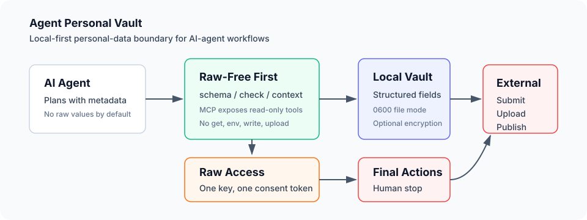

# Agent Personal Vault

日本語タイトル: AIエージェント向け個人情報ローカルVault

`Agent Personal Vault` は、Codex などのAIエージェントがユーザーの個人情報をローカルで管理し、必要な時だけ最小限に参照するためのローカルファーストな管理レイヤーです。



## Alpha Safety Notice

このプロジェクトはalpha版のローカル実験ユーティリティです。

- 既定では保存データを暗号化しません。
- 侵害済み端末、共有端末、マルウェア、OSユーザー権限を持つ攻撃者からは守れません。
- `get` と `env` はraw個人情報を表示します。ログ、Issue、スクリーンショット、外部AI、Subagent指示へ貼らないでください。
- `get` と `env` は事前に承認された一回限りのconsent tokenを要求します。
- public alphaの通常導線は、1回のconsentで1 keyだけを取得するone-key raw retrievalです。bulk raw exportはAIエージェントの通常導線ではありません。
- `get` / `env` / `set` / `unset` / `consent` / GUI操作はraw値なしの監査ログを書きます。状態変更・raw返却を伴う操作はrandom correlation IDで`prepared`、`committed`、`delivered`を記録し、途中失敗は`outcome_unknown`または未完了操作として可視化します。入力した`--purpose`の全文は永続化せず、固定reason codeまたは`[redacted]`とexact-purpose照合用digestだけを保存します。それでも実個人情報は入力しないでください。
- consent tokenは、同一OSユーザーやシェル実行権限を持つagentに対する強いセキュリティ境界ではありません。信頼できないagentにこのCLIや保存先へのアクセスを渡さないでください。
- 監査ログの `human_operated` はCLI/GUIなどの承認経路を示すメタデータであり、物理的に人間だけが操作したことの証明ではありません。
- 保存時暗号化はoptionalです。使う場合は `agent-personal-vault[encrypted]` とpassphraseが必要です。暗号化へ移行するとvault本体に加えてconsent/audit sidecarも保護されます。
- 法令遵守、本人確認、応募、送信、アップロード、契約、金融、医療、企業利用の安全性は保証しません。
- GitHub IssueやDiscussionに、氏名、住所、電話番号、メール、顔写真、証明書、実データのスクリーンショットを投稿しないでください。

安全な使い方は「raw値を保存する前に、まず `schema` / `context` / `check` でrawなしの流れを確認する」ことです。

## 5分で試す

まずはdummy値かローカルで扱ってよい値だけで試してください。`get` の結果はraw値なので、ログ、Issue、外部AIへ貼らないでください。

```sh
python3 -m venv .venv
. .venv/bin/activate
python3 -m pip install agent-personal-vault==0.1.21
export APV_STORE="$(mktemp -d)/vault.json"

agent-personal-vault --store "$APV_STORE" init
printf 'Example\n' | agent-personal-vault --store "$APV_STORE" set FAMILY_NAME --stdin --purpose profile_setup
printf 'Taro\n' | agent-personal-vault --store "$APV_STORE" set GIVEN_NAME --stdin --purpose profile_setup
printf 'taro@example.test\n' | agent-personal-vault --store "$APV_STORE" set EMAIL --stdin --purpose profile_setup

agent-personal-vault --store "$APV_STORE" context --task "応募フォームの氏名とメール連絡先を下書きする"
```

MCPクライアントには、stdio serverとして次のコマンドを設定します。このコマンドはserverとして待機するため、通常のシェルで順番に実行するコマンドではありません。

```sh
apv-mcp --store "$APV_STORE"
```

MCPクライアントでは、まず `apv.context` を呼び、raw値なしの候補keyを確認します。raw値が必要になったら `apv.request_consent` で `FULL_NAME` など1 keyだけを要求します。その後、GUIを起動して人間が承認します。

```sh
apv-gui --store "$APV_STORE" --open
```

承認後、GUIに一度だけ表示されるconsent idを使い、CLIでその1 keyだけを取得します。`consent list` はtokenを `c_[redacted]` として表示するため、consent idは復元できません。失った場合は新しいrequestを作成して、もう一度承認してください。

```sh
agent-personal-vault --store "$APV_STORE" get FULL_NAME --purpose local_draft --consent-id "<displayed-consent-id>"
agent-personal-vault --store "$APV_STORE" audit summary
agent-personal-vault --store "$APV_STORE" audit tail --limit 10
```

ここまでの安全な既定は、`context` / `apv.context` がraw値を返さず、`apv.request_consent` もraw値を返さず、raw取得は人間が承認した1 keyに限ることです。外部送信、フォーム送信、応募、メール送信はこのツールでは実行せず、人間確認で止めてください。

Codex、Claude Desktop、Claude Codeなどの設定例は [docs/MCP_CLIENT_SETUP.md](docs/MCP_CLIENT_SETUP.md) を参照してください。

## 位置づけ

この領域には、暗号化された個人コンテキストVault、MCPサーバー、資格情報Vault、PII redaction middleware などの先行OSSがあります。

`Agent Personal Vault` は新しいカテゴリを独占的に主張するものではありません。現時点の狙いは、次のような小さく監査しやすい実装です。

- 通常利用はPython標準ライブラリのみ
- CLIはdaemonなしで利用可能
- AIエージェント計画用の既定入口はraw値なしの `context`
- 保存値を読まない公開可能な `schema`
- 必要keyだけを `get` する最小raw取得
- Codexのようなローカル作業エージェント向けのfinal action境界

先行OSSとの比較メモは [docs/PRIOR_ART_REVIEW.md](docs/PRIOR_ART_REVIEW.md) にあります。
差別化方針とMVP境界は [docs/PRODUCT_POSITIONING.md](docs/PRODUCT_POSITIONING.md) にまとめています。

## 目的

- ユーザーに同じ個人情報を何度も入力させない。
- AIエージェントが必要な項目だけを、同意と監査の境界つきで取得できるようにする。
- raw個人情報をチャットログ、README、GitHub、外部API、Subagent指示へ不用意に流さない。
- 外部送信や応募などの final action は人間確認で止める。

## 同梱スキーマ

- `job_hunting_profile`
  - 氏名、ふりがな、生年月日
  - 住所、電話、メール
  - 大学、大学院、追加学歴
  - 資格
  - 顔写真ファイルパス

今後スキーマを増やす場合も、raw値を外へ出さない設計を維持します。

## インストール

通常利用:

```sh
python3 -m venv .venv
. .venv/bin/activate
python3 -m pip install agent-personal-vault==0.1.21
```

開発版:

```sh
python3 -m venv .venv
. .venv/bin/activate
python3 -m pip install -e .
```

通常利用の依存関係は標準ライブラリのみです。保存時暗号化を使う場合だけoptional extraを入れます。このextraは既知の対象advisoryを含む古い依存範囲を避けるため、`cryptography>=50.0.0`を要求します。

```sh
. .venv/bin/activate
python3 -m pip install 'cryptography>=50.0.0' 'agent-personal-vault[encrypted]==0.1.21'
```

開発版で保存時暗号化を試す場合は、次を使います。

```sh
. .venv/bin/activate
python3 -m pip install -e '.[encrypted]'
```

## 保存先

既定では次に保存します。

```text
~/.local/share/agent-personal-vault/vault.json
```

変更したい場合:

```sh
export AGENT_PERSONAL_VAULT_HOME="$HOME/.local/share/agent-personal-vault"
```

またはコマンドごとに:

```sh
agent-personal-vault --store /path/to/vault.json check
```

新規作成する保存ディレクトリは `0700`、保存ファイルは `0600` に設定されます。POSIX環境で既存のcustom親ディレクトリを指定した場合、現在のOSユーザー所有でgroup/otherからアクセスできない場所だけを受け入れます。権限は自動変更せず、安全でない場合は保存を拒否します。保存状態ファイルと一時ファイルは、検証済みの親ディレクトリに対するfd起点で開き、symbolic linkと複数hard linkを追従しません。共有・同期・公開される場所を保存先にしないでください。既定の平文JSONは、バックアップ、クラウド同期、Time Machineや仮想環境スナップショット、手動コピーに含まれると、元ファイルの権限境界の外へ複製されます。実データを保存する場合は、その保存先がバックアップ・同期対象かを確認し、必要ならoptional encryptionを有効にしてください。

可用性を守るため、保存JSONは12 MiB、各vault fieldは64 KiB、consent purposeは4 KiB、consent request/grantは合計2,000件、audit logは8 MiBまでに制限します。GUI request bodyは1 MiB、MCP messageは256 KiBまでです。JSON構造にも深さ32・20,000 nodeの上限があります。上限到達時は処理をfail-closedで拒否します。private stateが上限を超えて起動できない場合は、GUI/MCPを停止し、対象ファイルをowner-onlyの場所へbackupしてから、内容をIssueや外部AIへ貼らずに新しいdummy vaultで復旧手順を確認してください。これらはアプリケーションのメモリ・ディスク使用量を抑える安全策であり、OS quotaや複数ユーザー間の隔離ではありません。

保存した値を消す場合は、通常は `unset <KEY>` で1 keyずつ空にします。古いconsent metadataとaudit eventは自動削除されません。GUIとMCP serverを停止してから、明示的な保持期間を指定して整理できます。既定はconsent 30日、audit 90日です。この処理は旧版が保存したfree-form purposeも固定projectionへ書き換えます。破損したaudit行は証拠を勝手に捨てないため保持します。

```sh
agent-personal-vault --store "$APV_STORE" privacy prune --consent-retention-days 30 --audit-retention-days 90
```

誤って実データを入れた検証用vaultを丸ごと捨てる場合は、まず `check` で対象を確認し、GUIとMCP serverを停止してから次を使います。このコマンドは、指定vaultと同じ保存先にある `vault.json`、`consents.json`、`audit.jsonl` の3データファイルだけを削除し、親ディレクトリや無関係なファイルは削除しません。空のlock fileは残る場合があります。バックアップ、同期先、snapshot、手動コピーは別途管理対象です。

KDF migrationが未完了の場合、`privacy dispose`は全fileを変更せず拒否します。先に`encryption status-kdf`で状態を確認し、`encryption resume-kdf`または`encryption rollback-kdf`を完了してください。disposeはmigrationを自動で再開・rollbackしたり、復旧用artifactを一括削除したりしません。

```sh
agent-personal-vault --store "$APV_STORE" privacy dispose --confirm "delete local vault state"
```

削除対象が分からないまま `rm -rf` や親ディレクトリ削除を使わないでください。

## MCP Raw-Free Server

AIエージェント連携用に、raw値を返さないMCP stdio serverを提供します。

```sh
apv-mcp --store /path/to/vault.json
```

公開するtool:

- `apv.schema`
- `apv.context`
- `apv.check`
- `apv.list_masked`
- `apv.request_consent`

MCPでは `get`、`env`、`set`、`unset`、raw値取得、外部送信、フォーム送信は公開しません。`apv.request_consent` はraw値を返さず、GUIまたはCLIで人間が承認/拒否するためのリクエストだけを作成します。MCP stdio server自体は認証レイヤーを持たず、起動したローカルプロセスと、そのstdin/stdoutに接続できるMCPクライアントを信頼します。信頼できないagent、共有端末、複数ユーザー環境、意図しないプロセスから触れる状態で起動しないでください。

## CLI

初期化:

```sh
agent-personal-vault init
```

raw値を出さずに状態確認:

```sh
agent-personal-vault check
```

AIエージェント向けに、raw値なしのJSONコンテキストを取得:

```sh
agent-personal-vault context
```

用途が決まっている場合は、raw値なしで必要候補keyを絞るplanning hintsを取得できます。

```sh
agent-personal-vault context --task "応募フォームの氏名とメール連絡先を下書きする"
```

保存値を読まず、公開可能なスキーマ定義だけ確認:

```sh
agent-personal-vault schema
```

マスク表示:

```sh
agent-personal-vault list
```

`list` はraw断片を出さず、入力済みかどうかと文字数だけを表示します。

値を保存する。値はコマンド履歴に残さないため、実行後に入力します。

```sh
agent-personal-vault set FAMILY_NAME --purpose profile_setup
```

必要なkeyだけ取得:

```sh
agent-personal-vault consent request --action get --key FULL_NAME --purpose local_draft
agent-personal-vault get FULL_NAME --purpose local_draft --consent-id "<displayed-consent-id>"
```

`consent request` はrequest idを出力します。人間がGUIまたはhuman-operated CLIで承認すると、CLI `get` に渡すconsent idが一度だけ表示されます。AIエージェントの通常導線では `consent approve` を実行させず、人間の承認操作として扱ってください。`consent list` からtokenは復元できないため、失った場合は新しいrequestを作成して、もう一度承認してください。

保留中のrequestは10分で失効します。承認で発行するone-time tokenの既定有効期間は300秒で、CLIの`--ttl-seconds`は1〜3600秒に制限されます。失効後は古いrequestやtokenを再利用せず、新しいrequestを作成してください。

raw値のbulk export:

`env` は複数のraw値をshell export形式で表示するhuman-only advanced commandです。public alphaの既定では使わず、AIエージェントの通常導線、MCP連携、Quickstart、release validationには含めません。まずは `context` / `apv.context` でrawなし計画を作り、必要な場合だけ `get <KEY>` で1 keyずつ取得してください。

値を消す:

```sh
agent-personal-vault unset FAMILY_NAME --purpose profile_cleanup
```

raw値なしの監査ログを確認:

```sh
agent-personal-vault audit summary
agent-personal-vault audit tail --limit 10
```

監査ログの1行が中断や破損で不正になっていても、前後の有効なイベントは表示を続けます。CLIとGUIは不正な行の内容を表示せず、スキップした件数だけを警告します。監査ログは引き続き改ざん耐性のある証跡ではありません。

古いprivate metadataを明示的に整理:

```sh
agent-personal-vault privacy prune --consent-retention-days 30 --audit-retention-days 90
```

vault、consent state、audit logをまとめて廃棄:

```sh
agent-personal-vault privacy dispose --confirm "delete local vault state"
```

どちらもGUIとMCP serverを先に停止してください。`dispose` は既知の3データファイルだけを対象にし、バックアップ、同期先、snapshot、手動コピーまでは削除しません。未完了のKDF migrationがある場合は変更せず拒否するため、先に`encryption resume-kdf`または`encryption rollback-kdf`を完了してください。

consent requestとtoken metadataの状態を確認:

```sh
agent-personal-vault consent requests
agent-personal-vault consent list
```

`get` と `env` はraw値を出し、stderrに警告を表示します。ログ、公開Issue、外部AI、Subagent指示へ貼らないでください。`audit` と `consent` はkey名、action、固定purpose codeまたは`[redacted]`、rawを返したかどうかを記録します。`audit summary`の`operation_outcomes`は完了したdelivery、拒否、判定不能を集計し、`incomplete_operations`は`prepared`または`committed`のまま止まった操作を示します。判定不能なraw操作は自動再試行せず、人間がstateとauditを確認してください。exact purposeは照合用digestへ束縛しますが、全文もraw値も記録しません。表示可能なcodeは `local_draft`、`profile_setup`、`profile_update`、`profile_cleanup`、`encryption_migration`、`test_dummy` に限定されます。

保存時暗号化の状態確認:

```sh
agent-personal-vault encryption status
```

新規暗号化はversion 2 envelopeとArgon2id profileを使います。既存のversion 1 PBKDF2 envelopeは読込みと通常保存でそのまま維持され、読込みや編集だけで暗黙に再暗号化されません。version 1からの移行はGUI/MCPには公開せず、GUIとMCP serverを停止してから人間がCLIで明示実行します。

暗号化へ移行:

```sh
agent-personal-vault encryption encrypt --purpose encryption_migration
```

新規暗号化では12文字以上かつ明白に予測しにくいpassphraseを要求します。弱い値を互換性上どうしても使う場合だけ `--allow-weak-passphrase` でoffline guessingリスクを明示的に受け入れます。新たに発行したconsent tokenは呼び出し元へ一度だけ返し、保存時は照合用digestだけを保持します。

過去版ですでに暗号化したvaultをupgradeした場合は、既存のconsent/audit sidecarを明示的に移行してください。GUIとMCP serverを停止し、backupを確認してから次を実行します。

```sh
agent-personal-vault encryption protect-sidecars --purpose encryption_migration
```

`encryption status` では、存在するsidecarについて対応する `*_sidecar_encrypted` が `true` になることを確認してください。`*_sidecar_exists` が `false` なら、その種類のmetadata fileはまだありません。backup、sync replica、snapshot、手動コピーはこの移行の対象外です。

version 1 vaultと存在するsidecarをcurrent KDF profileへ移行:

```sh
agent-personal-vault encryption upgrade-kdf --purpose encryption_migration
```

移行は全対象を復号・検証し、current profileで再暗号化した候補を再復号してから置換します。各fileの置換は原子的ですが、vault・consent・auditを単一filesystem transactionとして同時置換するものではありません。途中停止時は通常書込みがfail-closedになり、`encryption status`の`kdf_migration`へ状態が表示されます。状態を確認したうえで、同じpassphraseを使い次のどちらかを明示実行します。

```sh
agent-personal-vault encryption resume-kdf --purpose encryption_migration
agent-personal-vault encryption rollback-kdf --purpose encryption_migration
```

resume/rollbackが完了すると、owner-onlyのmigration journal、暗号化済みbackup、staging fileは削除されます。外部backup、sync replica、snapshot、手動コピーは変更されません。

暗号化を解除すると同じ保存先が平文JSONへ置き換わり、backup、sync、snapshotにも平文が残り得ます。専用の確認flagなしでは実行されません。

```sh
agent-personal-vault encryption decrypt --purpose encryption_migration --i-understand-plaintext-persistence
```

暗号化されたvaultを通常CLIで読む場合は、環境変数でpassphraseを渡します。値はログや公開Issueへ出さないでください。

```sh
export AGENT_PERSONAL_VAULT_PASSPHRASE="..."
agent-personal-vault check
```

## GUI

```sh
apv-gui --open
```

GUIは `127.0.0.1` にだけbindし、起動ごとに5分間・1回限りのbootstrap URLを発行します。最初のアクセス後はtokenをURLから除去し、15分で失効するlocalhost session cookieへ切り替えます。session失効後に続ける場合はGUI processを再起動してください。必要な時だけ起動し、作業後は `Ctrl-C` で停止してください。保留中の同意リクエストはGUI右側で承認/拒否できます。マスク中は入力値の断片、選択値、派生氏名を表示しません。GUIでのプロフィール表示と保存は、raw値なしの監査ログに記録されます。

## AIエージェント向け安全手順

1. まず `check` を使い、入力済み件数と不足項目だけを見る。CLI `check` はローカル確認用にstore pathを表示します。agent-facingにはpathを含まない `context` またはMCP `apv.check` / `apv.context` を使ってください。
2. エージェントの計画には、まず `context` のraw値なしJSONを使う。用途が決まっていれば `context --task "<raw値を含まない用途>"` で必要候補keyを絞る。MCPクライアントでは `apv.context` を使う。
3. raw値が必要な場合は、まず `consent request` で対象keyと目的を固定したリクエストを作る。
4. 人間がGUIまたはhuman-operated CLIで承認・拒否する。AIエージェント自身に承認コマンドを実行させない。
5. 承認された対象keyを1つずつ `get <KEY> --purpose local_draft --consent-id "<token>"` で取得する。承認requestと取得時は同じexact purposeを使う。
6. raw値を最終報告、公開成果物、外部API、検索クエリ、GitHub、メール、SNS、応募サイトへ無断で送らない。
7. 外部送信、応募、登録、アップロード、メール送信は final action として止める。
8. Subagentやworkerへraw値を渡さない。必要なら親エージェントが最小限の取得と貼り付けを担当する。
9. 必要に応じて `audit summary` または `audit tail` でrawなしの利用履歴を確認する。

詳しいプロトコルは [docs/AGENT_PROTOCOL.md](docs/AGENT_PROTOCOL.md) を参照してください。

## セキュリティ上の限界

- このツールはローカルの秘密メモに近いです。
- OSのユーザー権限を越えた攻撃者、マルウェア、侵害済み端末からは守れません。
- 同じOSユーザーとしてシェル実行できるagentやプロセスからは、CLI操作そのものを強制的に止められません。consentとauditはワークフロー制御と記録のための仕組みです。
- 既定では暗号化しません。optional extraでAES-256-GCM暗号化backendを使えますが、passphrase管理はユーザー責任です。macOS Keychain、Windows Credential Manager、libsecret対応は今後の候補です。
- audit logはraw値なしの利用履歴であり、改ざん不能な証跡ではありません。同じOSユーザーや侵害済み端末は `audit.jsonl` を編集・削除できます。
- 起動時のbootstrap URLは一回限りですが、ターミナルログやスクリーンショットへ残さず、raw値もブラウザ履歴へ残さない運用が必要です。
- Windowsなど非POSIX環境では、owner-privateな親ディレクトリとsymlink-safeなfd起点I/Oを同等に保証できないため、現在の保存操作はfail-closedで拒否します。Windows対応はACL・reparse point・競合lockを実機検証した後の別レーンです。
- 暗号化、MCP連携、強い権限委譲が必要な用途では、既存のpersonal context vaultやsecret manager系OSSも比較してください。
- このプロジェクトは現時点でalphaです。強いセキュリティ、法令遵守、エンタープライズ用途を主張しません。

## メンテナ向けチェック

<details>
<summary>公開前チェック</summary>

このリポジトリには実データを入れないでください。

- `vault.json`
- `private/`
- 顔写真
- バックアップ
- スクリーンショット
- ローカル絶対パス入り設定

公開前に次を実行してください。

```sh
make release-check
```

`make` を使わない場合:

```sh
python3 scripts/check_release.py
```

関連ドキュメント:

| Document | Purpose |
|---|---|
| [Publication Gate](docs/PUBLICATION_GATE.md) | visibility変更やpublish前の停止条件 |
| [Private Dry Run Report](docs/PRIVATE_DRY_RUN_REPORT.md) | private GitHub dry-runの確認結果 |
| [Public Release Review](docs/PUBLIC_RELEASE_REVIEW.md) | public公開可否レビュー |
| [Pre-Public Objective Review](docs/PRE_PUBLIC_OBJECTIVE_REVIEW.md) | public公開前の客観レビューと残リスク |
| [OSS Governance](docs/OSS_GOVERNANCE.md) | Issue / PR / branch protection運用 |
| [Release/Package Dry-Run Plan](docs/RELEASE_PACKAGE_DRY_RUN_PLAN.md) | release/package publish前のdry-run確認項目 |
| [PyPI Trusted Publishing Plan](docs/PYPI_TRUSTED_PUBLISHING_PLAN.md) | PyPI Trusted Publishing導入可否とpublish workflow案 |
| [Branch Cleanup Candidates](docs/BRANCH_CLEANUP_CANDIDATES.md) | merged済みcodex branchの削除候補検証 |
| [RC Approval Plan](docs/RC_APPROVAL_PLAN.md) | release / tag / package publish / 告知の個別承認レーン |
| [RC Approval Packet](docs/RC_APPROVAL_PACKET.md) | RC実行前の対象commit・release note・承認文レビュー |
| [Reputation Risk Review](docs/REPUTATION_RISK_REVIEW.md) | 表現・炎上リスクの確認 |
| [Launch Messaging](docs/LAUNCH_MESSAGING.md) | README、release notes、告知文の安全な書き方 |
| [Announcement Approval Packet](docs/ANNOUNCEMENT_APPROVAL_PACKET.md) | 告知文案、禁止表現チェック、投稿後監視、撤回手順 |

</details>

## ライセンス

MIT License。
